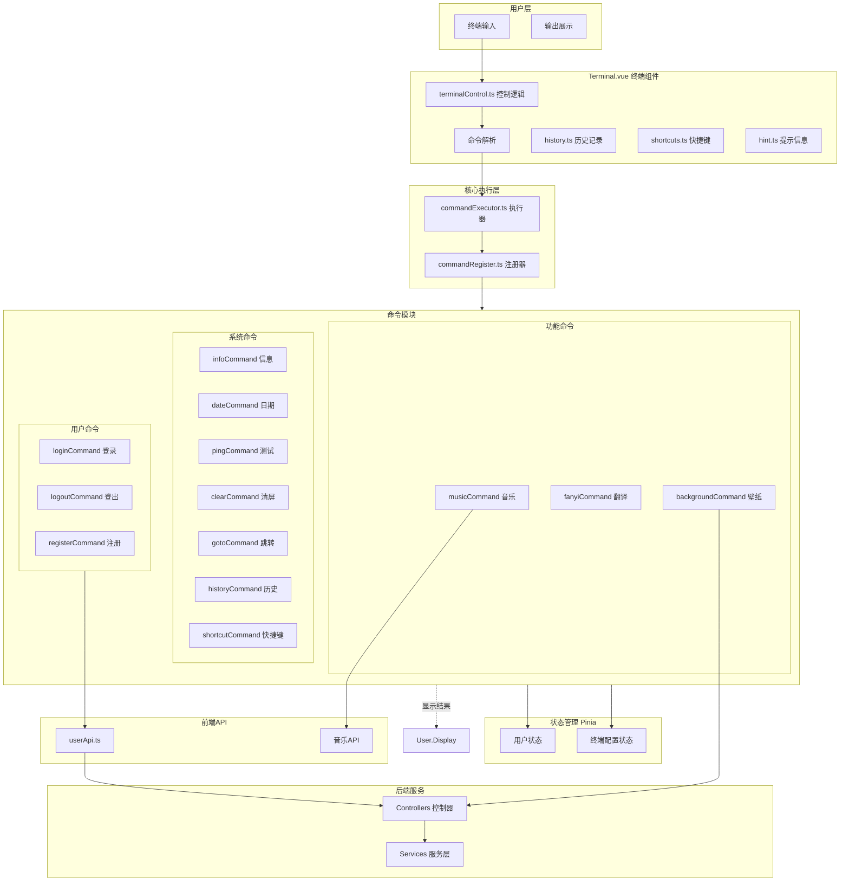
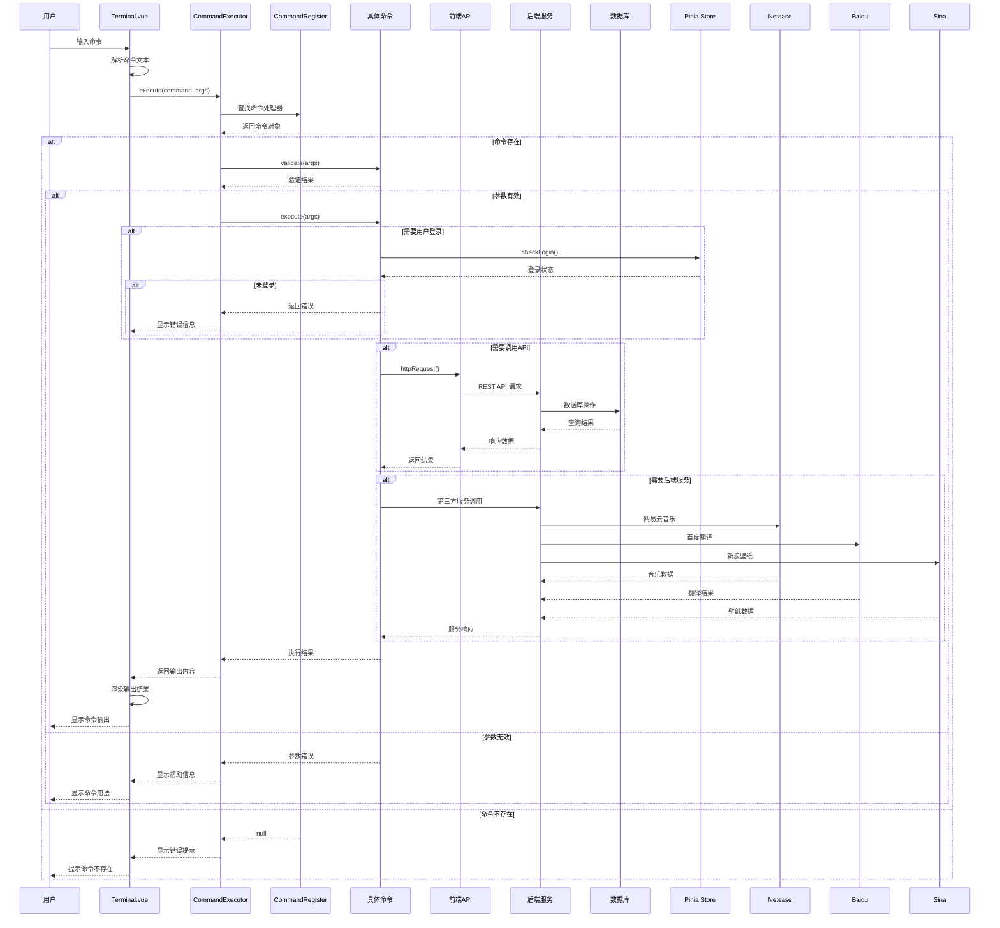
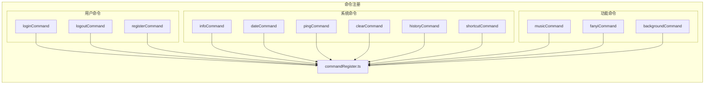
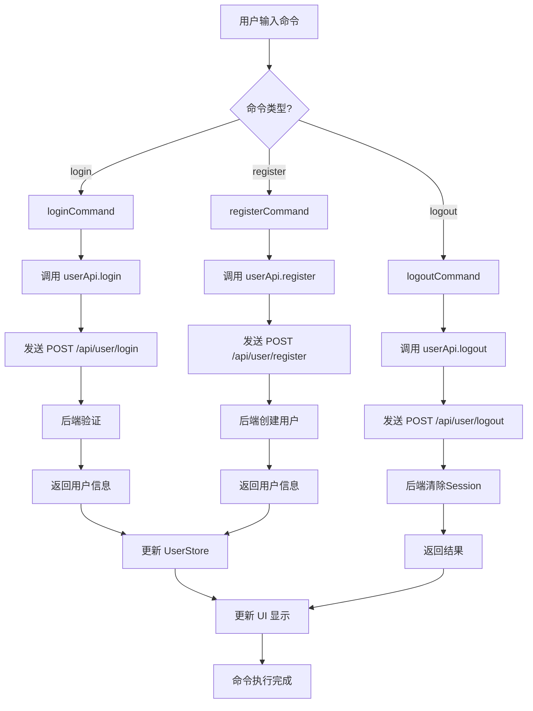
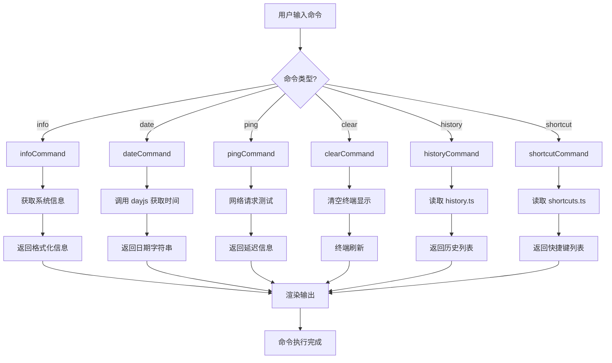
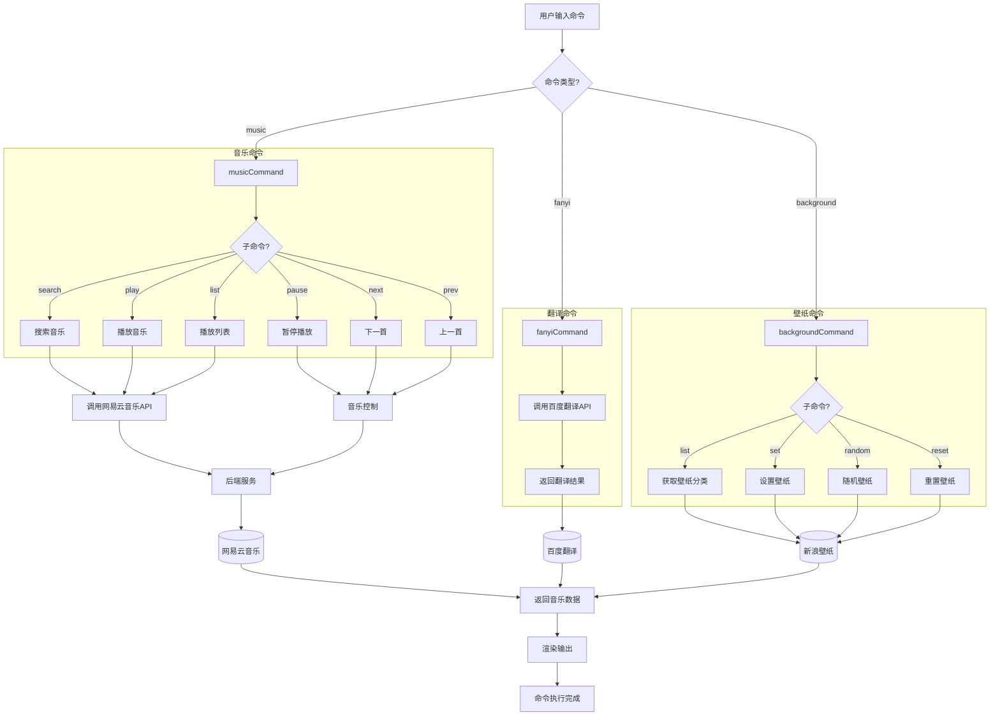
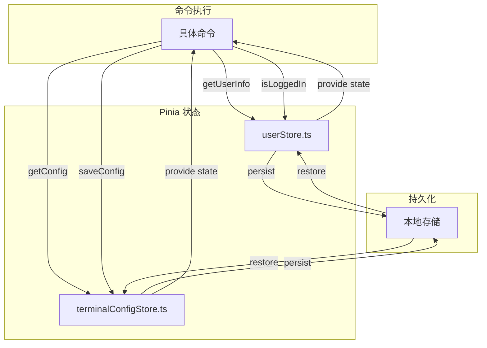
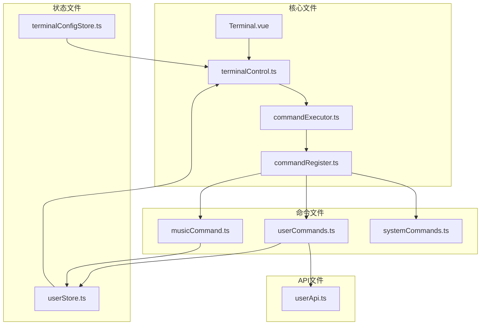

# Termix——你的个性化 Web 终端

## 项目概述

Termix 是一款基于 Vue 3 构建的个性化 Web 终端应用，旨在为用户提供一个功能丰富、高度可定制的在线终端体验。该项目采用现代化的前端技术架构，同时配备了完整的 Node.js 后端服务体系，支持用户认证、音乐播放、翻译服务、壁纸切换等多种实用功能。通过模拟真实终端的操作界面和交互方式，Termix 让用户能够在浏览器中享受接近原生终端的使用感受，同时兼具 Web 应用的便捷性和跨平台优势。

本项目采用前后端分离架构设计，前端基于 Vue 3 框架和 TypeScript 语言开发，使用 Vite 作为构建工具，配合 Pinia 进行状态管理，并通过 xterm.js 实现了专业的终端模拟功能。后端服务基于 Express 框架构建，采用 MySQL 作为主要数据存储，Redis 用于会话管理和缓存加速，Sequelize 作为对象关系映射（ORM）框架简化数据库操作。这种架构设计确保了系统的可扩展性和可维护性，同时为后续功能迭代提供了良好的技术基础。

## 主要功能

Termix 终端应用具备丰富的内置命令和实用功能，能够满足用户在日常使用中的多种需求。系统支持交互式命令输入，用户可以通过命令行与系统进行实时交互，执行各类操作并获取即时反馈。所有命令都经过精心设计，具有清晰的使用说明和参数提示，帮助用户快速上手并熟练掌握各项功能。

在用户管理方面，系统提供了完整的用户注册和登录功能，支持用户创建个人账户并保存自己的使用偏好和历史记录。用户登录后可以享受个性化的服务体验，系统会自动同步用户的配置数据和操作历史，确保在不同设备间提供一致的使用感受。退出登录功能则允许用户安全地结束当前会话，保护账户安全。

音乐播放是 Termix 的特色功能之一，系统集成了网易云音乐 API，为用户提供在线音乐播放服务。用户可以通过简单的命令搜索和播放喜爱的音乐，享受在工作环境中聆听音乐的便捷体验。播放控制包括播放、暂停、切换等基本操作，同时支持歌曲搜索和歌词显示功能。

翻译功能集成了百度翻译 API，为用户提供便捷的多语言翻译服务。用户可以直接在终端中输入翻译命令，快速获取目标语言的翻译结果。该功能支持多种语言之间的互译，满足用户在阅读外语文档或与外国友人交流时的翻译需求。

壁纸管理功能允许用户自定义终端界面的背景样式，系统接入了新浪壁纸 API，提供丰富的壁纸资源供用户选择。用户可以根据个人喜好随时更换终端背景，打造独一无二的个性化工作环境。

系统信息查询功能为用户提供了了解系统状态的便捷途径，通过相应的命令可以查看终端版本、运行环境、运行时间等关键信息。这对于问题排查和性能监控都非常有帮助。

快捷键提示功能列出了终端支持的各类快捷键操作，帮助用户提高操作效率。掌握这些快捷键可以显著提升使用体验，让日常操作更加流畅高效。

## 技术栈说明

### 前端技术

前端项目采用了当前业界主流的 Vue 3 生态系统，构建了一套现代化、高性能的用户界面。Vue 3 作为核心框架，提供了组合式 API（Composition API）、更好的类型支持和优化的渲染性能，为开发复杂交互界面奠定了坚实基础。TypeScript 语言的引入显著提升了代码的可维护性和可读性，通过静态类型检查能够在编译阶段发现潜在的类型错误，减少运行时错误的发生。

Vite 作为新一代前端构建工具，提供了极快的开发服务器启动速度和热模块替换（HMR）能力。相比传统的 Webpack 构建方式，Vite 利用浏览器原生 ES 模块支持实现了更快速的开发体验，同时生产环境构建采用 Rollup 打包，确保输出代码的优化和高效。开发环境下，Vite 启动时间从原来的数十秒缩短至毫秒级别，极大地提升了开发效率。

状态管理方面，项目选用了 Pinia 作为状态管理方案。Pinia 是 Vue 官方推荐的状态管理库，相比 Vuex 具有更简洁的 API 设计、完整的 TypeScript 支持和模块化的状态组织方式。通过 Pinia，项目实现了用户信息、会话状态、终端配置等数据的集中管理，并通过 pinia-plugin-persistedstate 插件实现了状态的持久化存储。

终端模拟功能基于 xterm.js 实现，这是一个在浏览器中运行的高性能终端模拟器。xterm.js 完全兼容 ANSI 终端标准，支持 256 色显示、鼠标事件处理、文本选择等原生终端功能。项目还集成了 xterm-addon-fit 插件实现终端尺寸的自动适配，以及 xterm-addon-web-links 插件支持链接的自动识别和点击跳转。

用户界面组件库选用了 Ant Design Vue，这是 Ant Design 的 Vue 3 实现版本，提供了丰富的高质量组件和统一的设计规范。通过 unplugin-vue-components 插件实现了组件的按需加载，避免了完整组件库的打包体积开销，优化了应用性能。

网络请求使用 Axios 库进行封装，提供了统一的请求拦截、响应处理和错误处理机制。项目对 Axios 进行了二次封装，集成了请求 Loading 状态管理、登录态自动判断、错误提示等功能，简化了业务层的网络调用代码。

### 后端技术

后端服务基于 Node.js 平台和 Express 框架构建，提供 RESTful API 接口供前端调用。Express 框架以其简洁灵活的设计和丰富的中间件生态著称，非常适合构建中小型的 Web 服务应用。项目在 Express 基础上封装了统一的响应格式、全局异常处理、请求日志记录等基础设施，确保了接口的一致性和可维护性。

会话管理采用 express-session 中间件实现，并使用 connect-redis 将会话数据存储到 Redis 中，实现了会话的分布式支持。这种设计使得后端服务可以部署多个实例而不会影响会话的一致性，同时 Redis 的高性能特性保证了会话读写的效率。

数据持久化方面，项目选用 MySQL 作为主要的关系型数据库，存储用户信息、配置数据、业务记录等结构化数据。Sequelize 作为 ORM 框架，提供了模型定义、关联管理、查询构建器等功能，大幅简化了数据库操作代码，同时支持数据库迁移便于版本管理。

第三方服务集成方面，系统接入了网易云音乐 API 提供音乐播放功能，使用百度翻译 API 实现多语言翻译服务，并调用新浪壁纸 API 获取壁纸资源。这些 API 的集成丰富了终端应用的功能，为用户提供了多样化的使用体验。

## 环境要求与安装步骤

### 环境要求

在开始安装和运行项目之前，请确保开发环境满足以下要求。操作系统方面，项目支持 Windows、macOS 和 Linux 主流操作系统，推荐使用 Windows 10 及以上版本或对应的 macOS、Linux 发行版以获得最佳兼容性和支持。

Node.js 版本要求 16.0.0 或更高，建议使用 LTS（长期支持）版本以确保稳定性和安全性。您可以通过访问 Node.js 官方网站（https://nodejs.org）下载安装包，或使用 nvm（Node Version Manager）管理多个 Node.js 版本。安装完成后，可在终端执行 `node --version` 和 `npm --version` 命令验证安装是否成功。

包管理器方面，项目支持 npm、yarn 和 pnpm 三种包管理器。推荐使用 yarn 或 pnpm 以获得更好的依赖管理和缓存机制。若使用 npm，建议版本 7.0.0 以上；若使用 yarn，建议版本 1.22.0 以上；若使用 pnpm，建议版本 7.0.0 以上。

数据库方面，项目依赖 MySQL 8.0 或更高版本以及 Redis 6.0 或更高版本。请确保这两个数据库服务已正确安装并在本地运行。对于开发环境，可以选择安装 MySQL Community Server 和 Redis Server；对于生产环境，建议使用云数据库服务或容器化部署方案。

版本控制工具方面，项目使用 Git 进行版本控制，请确保已安装 Git 并配置好 SSH 密钥或访问令牌以便克隆代码仓库。

### 前端项目安装

前端项目位于项目根目录，首先进入项目根目录并切换到前端目录。执行以下命令安装项目依赖：

```bash
cd termix-vue
npm install
```

或者使用 yarn：

```bash
cd termix-vue
yarn install
```

或者使用 pnpm：

```bash
cd termix-vue
pnpm install
```

依赖安装完成后，项目即可进行开发运行。开发环境启动命令为：

```bash
npm run dev
```

该命令会启动 Vite 开发服务器，默认运行在 http://localhost:5173 端口。打开浏览器访问该地址即可看到 Termix 终端界面。在开发模式下，代码修改后页面会自动热更新，无需手动刷新。

构建生产版本命令为：

```bash
npm run build
```

该命令会执行 TypeScript 类型检查（通过 vue-tsc），然后使用 Vite 构建优化后的生产版本代码。构建产物输出到 `dist` 目录，可部署到任何静态文件服务器。

此外，项目还支持构建 Chrome 扩展版本：

```bash
npm run build:crx
```

### 后端项目安装

后端项目位于 `server` 目录，进入该目录并安装依赖：

```bash
cd server
npm install
```

在启动后端服务之前，需要配置数据库连接信息。配置文件位于 `server/src/config` 目录，复制或创建 `config.prod.js` 文件并填入实际的数据库配置：

```javascript
// config.prod.js
module.exports = {
  dbConfig: {
    database: "termix",
    username: "your_username",
    password: "your_password",
    host: "localhost",
    port: 3306
  },
  redisConfig: {
    host: "localhost",
    port: 6379
  },
  // 其他配置项...
};
```

同时需要执行数据库/db/ddl.sql初始化脚本 `server` 创建所需的表结构。可以使用 MySQL 客户端工具或命令行执行：

```bash
mysql -u your_username -p your_database < server/db/ddl.sql
```

启动后端开发服务：

```bash
cd server
npm run start:dev
```

该命令会以开发模式启动后端服务，支持代码修改后自动重启。服务默认监听端口为 7345，可通过配置修改。

启动生产环境服务：

```bash
cd server
npm run start
```

## 使用说明

### 启动项目

完整的项目启动流程包括前端开发服务器和后端服务的启动。首先确保 MySQL 和 Redis 数据库服务已正常运行，然后按照以下步骤操作：

第一步，启动后端服务。打开终端，进入 server 目录执行 `npm run start:dev` 命令，等待服务启动完成后会看到类似「Server started on port 7345」的提示信息。

第二步，启动前端开发服务器。新开一个终端窗口，进入项目根目录执行 `npm run dev` 命令，等待编译完成后浏览器会自动打开 http://localhost:5173 地址展示 Termix 终端界面。

如果一切正常，您将看到欢迎界面和命令提示符，可以开始输入命令与终端进行交互。

### 基本操作流程

Termix 终端的使用方式类似于传统命令行界面，用户在输入区域输入命令，按回车键执行，系统会在终端区域显示命令输出结果。每个命令都可能有参数选项，可以使用 `help` 命令查看所有可用命令及其使用说明。

用户相关操作方面，未注册用户可以使用 `register` 命令创建新账户，需要提供用户名、邮箱和密码等信息。已注册用户使用 `login` 命令登录系统，输入正确的用户名和密码后即可进入登录状态。登录后系统会显示欢迎信息并记住用户身份，后续操作将关联到用户数据。`logout` 命令用于退出当前登录状态，清除会话信息。

系统命令方面，`info` 命令显示当前系统的版本信息、运行时间和环境配置等详细资料。`date` 命令显示当前日期时间，可用于快速查看时间。`ping` 命令用于测试网络连接状态，输入 `ping` 加上目标地址即可发起连通性测试。`clear` 命令用于清空当前终端屏幕，让界面恢复整洁。`goto` 命令可以在终端内跳转到指定的 URL 链接。

音乐播放功能使用 `music` 命令及其子命令操作。`music search <关键词>` 用于搜索歌曲，`music play <歌曲ID>` 用于播放指定歌曲，`music pause` 暂停播放，`music resume` 继续播放，`music next` 播放下一首，`music prev` 播放上一首，`music list` 显示当前播放列表。

翻译功能使用 `fanyi` 或 `translate` 命令，格式为 `fanyi <源语言> <目标语言> <文本>`，例如 `fanyi en zh 你好` 会将「你好」翻译成英文。也可以使用简化的 `fy` 命令进行快速翻译。

壁纸设置使用 `background` 命令，`background list` 列出可选的壁纸分类，`background set <壁纸ID>` 更换壁纸，`background random` 随机更换壁纸，`background reset` 恢复默认壁纸。

查看命令历史使用 `history` 命令，可以浏览之前执行过的所有命令记录，便于重复执行历史命令或回顾操作历史。

查看快捷键使用 `shortcut` 或 `快捷键` 命令，会显示终端支持的所有快捷键说明，包括光标移动、文本编辑、历史命令切换等常用操作。

### 配置文件说明

前端配置主要位于 `src/configs` 目录下的 `routes.ts` 文件，定义了应用的路由配置。API 请求的基础地址和拦截器配置位于 `src/plugins/myAxios.ts` 文件，如有需要可以修改 `baseURL` 以适应不同的后端服务地址。

后端配置位于 `server/src/config` 目录，`config.js` 文件包含默认配置，`config.prod.js` 文件用于生产环境覆盖默认配置。配置项包括数据库连接信息、Redis 连接信息、第三方 API 密钥、邮件服务配置等。敏感配置信息如数据库密码、API 密钥等建议通过环境变量或独立的配置文件管理，避免提交到版本控制系统。

## 目录结构说明

```
termix-vue/
├── .vscode/                # VS Code 编辑器配置
│   └── extensions.json     # 推荐的 VS Code 扩展列表
├── public/                 # 静态资源目录（构建时直接复制）
│   └── vite.svg           # Vite 图标
├── server/                 # 后端服务目录
│   ├── db/                 # 数据库相关文件
│   │   └── ddl.sql        # 数据库表结构定义脚本
│   ├── src/                # 后端源码目录
│   │   ├── config/        # 配置文件目录
│   │   │   ├── config.js  # 默认配置文件
│   │   │   └── getConfig.js # 配置获取工具
│   │   ├── controller/    # 控制器层（处理请求）
│   │   │   ├── backgroundController.js  # 壁纸相关接口
│   │   │   ├── fanyiController.js       # 翻译相关接口
│   │   │   ├── musicController.js       # 音乐相关接口
│   │   │   └── userController.js        # 用户相关接口
│   │   ├── exception/     # 异常处理模块
│   │   │   ├── errorCode.js  # 错误码定义
│   │   │   └── index.js      # 异常处理中间件
│   │   ├── model/         # 数据模型定义
│   │   │   ├── user.js    # 用户模型
│   │   │   └── vo/        # 视图对象模型
│   │   ├── service/       # 业务逻辑层
│   │   │   ├── musicService.js  # 音乐业务逻辑
│   │   │   └── userService.js   # 用户业务逻辑
│   │   ├── thirdpart/     # 第三方服务集成
│   │   │   ├── baiduFanYi/   # 百度翻译 API
│   │   │   ├── backgroundApi.js # 壁纸 API
│   │   │   └── neteaseMusicApi.js # 网易云音乐 API
│   │   ├── db.js          # 数据库连接初始化
│   │   ├── index.js       # 应用入口
│   │   ├── routes.js      # 路由定义
│   │   └── server.js      # 服务器配置
│   ├── Dockerfile         # Docker 构建文件
│   ├── package.json       # 后端依赖配置
│   └── README.md          # 后端项目文档
├── src/                    # 前端源码目录
│   ├── assets/            # 静态资源（会被 Vite 处理）
│   │   └── vue.svg       # Vue 图标
│   ├── components/        # Vue 组件目录
│   │   └── terminal/     # 终端相关组件
│   │       ├── ContentOutPut.vue  # 命令输出展示组件
│   │       ├── Terminal.vue       # 终端主组件
│   │       ├── hint.ts    # 提示信息配置
│   │       ├── history.ts # 历史记录管理
│   │       ├── shortcuts.ts # 快捷键配置
│   │       ├── terminalControl.ts # 终端控制逻辑
│   │       └── type.t.ts  # TypeScript 类型定义
│   ├── configs/           # 配置文件目录
│   │   └── routes.ts     # 路由配置
│   ├── core/              # 核心逻辑模块
│   │   ├── commands/      # 命令实现目录
│   │   │   ├── terminal/  # 终端内置命令
│   │   │   └── user/      # 用户相关命令
│   │   ├── commandExecutor.ts  # 命令执行器
│   │   └── commandRegister.ts  # 命令注册器
│   ├── pages/             # 页面组件目录
│   │   └── IndexPage.vue  # 首页组件
│   ├── plugins/           # Vue 插件目录
│   │   ├── myAxios.ts     # Axios 封装
│   │   └── myDayjs.ts     # Dayjs 插件
│   ├── utils/             # 工具函数目录
│   │   └── smartText.ts   # 文本处理工具
│   ├── App.vue            # 根组件
│   ├── env.d.ts           # 环境变量类型声明
│   ├── main.ts            # 应用入口
│   └── style.css          # 全局样式
├── .gitignore             # Git 忽略配置
├── components.d.ts        # 组件类型声明
├── index.html             # HTML 入口文件
├── package.json           # 前端依赖配置
├── tsconfig.json          # TypeScript 编译配置
├── tsconfig.app.json      # 应用 TypeScript 配置
├── tsconfig.node.json     # 节点 TypeScript 配置
├── vite.config.ts         # Vite 构建配置
└── yarn.lock              # Yarn 依赖锁定文件
```

## 贡献指南

我们欢迎并感谢社区开发者为 Termix 项目贡献代码和创意。参与贡献不仅可以提升个人技术能力，还能帮助项目持续改进和成长。在开始贡献之前，请先阅读本贡献指南了解项目的开发流程和规范要求。

### 前期准备

首先将项目仓库 Fork 到自己的 GitHub 账户，然后克隆 Fork 后的仓库到本地进行开发。建议保持主分支与上游仓库同步，定期拉取最新代码以避免合并冲突。在开始实现新功能或修复问题之前，创建一个新的分支进行开发工作，分支命名应清晰反映要解决的问题或添加的功能。

### 开发规范

代码风格方面，项目使用 ESLint 和 Prettier 进行代码规范检查和格式化。所有新增代码必须通过 ESLint 检查，不能存在警告或错误。建议在开发过程中配置编辑器保存时自动格式化，确保代码风格的一致性。TypeScript 代码应遵循项目已有的类型定义模式，复杂函数和组件应添加适当的类型标注。

Git 提交信息应遵循 Conventional Commits 规范，格式为 `<type>(<scope>): <description>`，例如 `feat(terminal): add new music play command` 或 `fix(user): resolve login session issue`。Type 类型包括 feat（新功能）、fix（修复 bug）、docs（文档更新）、refactor（代码重构）、test（测试相关）等。

### 提交流程

完成代码开发并通过本地测试后，提交您的更改并推送到 Fork 的仓库。然后在 GitHub 上创建一个 Pull Request，描述您所做的更改、解决的问题或添加的功能。如果修复了已知问题，请在描述中关联相关 Issue。维护者会尽快审查您的 Pull Request，可能提出修改建议或直接合并。

### 测试要求

对于新添加的功能，建议编写相应的单元测试或集成测试以确保代码质量。测试文件应与源代码放在同一目录，使用 `.spec.ts` 或 `.test.ts` 作为文件后缀。运行 `npm run tsc` 执行 TypeScript 类型检查，确保没有类型错误后再提交代码。

## 许可证信息

Termix 项目采用 MIT 许可证开源，这意味着您可以自由地使用、修改和分发本项目的代码，包括商业用途。MIT 许可证是一种宽松的开源许可证，仅要求保留原始版权声明和许可证文本。

使用本项目时，请确保遵守所有依赖库的许可证要求。项目中使用到的第三方库包括 Ant Design Vue（MIT）、xterm.js（MIT）、NeteaseCloudMusicApi（MIT）等，这些库同样采用开源许可证，在各自的使用范围内是合法的。

## 联系方式

如果您在使用过程中遇到问题、有功能建议或希望参与项目开发，欢迎通过以下方式与我们联系。通过 GitHub Issues 提交问题报告或功能请求是沟通技术问题的最佳方式，我们会及时查看并回复。每一条反馈都对项目的改进非常重要，无论是功能建议、Bug 报告还是文档完善，我们都非常欢迎。

项目维护者会定期查看邮件和 GitHub 通知，但可能无法立即回复所有消息。对于紧急问题或需要深入讨论的事项，建议通过 GitHub Discussion 进行交流。对于安全相关的问题，请通过私下渠道报告以避免信息泄露。

感谢您对 Termix 项目的关注和支持，我们期待与您共同打造一个更出色的 Web 终端应用。


# Termix 命令执行流程

## 命令执行架构图



## 命令执行流程图



## 命令注册流程



## 用户命令流程



## 系统命令流程



## 功能命令流程



## 状态管理流程



## 核心文件关系


